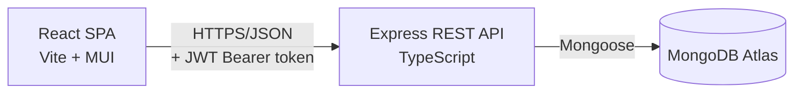

# Penta — Financial Analytics Dashboard

A full-stack financial analytics platform with JWT authentication, interactive
revenue/expense visualizations, a searchable and filterable transaction table,
and a configurable CSV export pipeline.

Built for the Loopr AI full-stack technical assignment.

---

## Table of Contents

- [Overview](#overview)
- [Tech Stack](#tech-stack)
- [Architecture](#architecture)
- [Project Structure](#project-structure)
- [Prerequisites](#prerequisites)
- [Getting Started](#getting-started)
  - [1. Clone & Install](#1-clone--install)
  - [2. Configure Environment Variables](#2-configure-environment-variables)
  - [3. Seed the Database](#3-seed-the-database)
  - [4. Run the App](#4-run-the-app)
- [Demo Credentials](#demo-credentials)
- [Available Scripts](#available-scripts)
- [Core Features](#core-features)
- [API Documentation](#api-documentation)
- [Design Decisions](#design-decisions)
- [Known Limitations](#known-limitations)

---

## Overview

Penta lets an analyst log in, view a summary of revenue, expenses, and
balance, explore trends and category breakdowns on interactive charts, and drill
into the underlying transactions with multi-field filtering, search, and sorting.
Any filtered view can be exported to a CSV with a user-chosen set of columns.

## Tech Stack

| Layer          | Technology                                    |
|----------------|------------------------------------------------|
| Frontend       | React 19, TypeScript, Vite, MUI, Recharts, Axios, React Router |
| Backend        | Node.js, Express 5, TypeScript                  |
| Database       | MongoDB (Mongoose ODM)                          |
| Auth           | JWT (JSON Web Tokens), bcrypt password hashing  |
| Validation     | Zod                                             |
| Security       | Helmet, CORS, rate limiting                     |

## Architecture



- The frontend never talks to MongoDB directly — all data access goes through
  the authenticated REST API.
- JWTs are issued on login and sent as an `Authorization: Bearer <token>` header
  on every subsequent request; the backend is otherwise stateless.
- Filtering, searching, sorting, and pagination are all performed server-side
  via a single reusable MongoDB aggregation pipeline (`query.service.ts`), so
  the transaction table, analytics endpoints, and CSV export all stay consistent
  with the same filters.

## Project Structure

```
loopr-finance/
├── backend/
│ ├── src/
│ │ ├── config/ # DB connection
│ │ ├── controllers/ # Route handlers (auth, transactions, analytics, export)
│ │ ├── middleware/ # JWT auth guard, error handler
│ │ ├── models/ # Mongoose schemas (Account, Member, Transaction)
│ │ ├── routes/ # API route definitions
│ │ ├── services/ # Query builder, CSV generator
│ │ ├── utils/ # JWT helpers, ApiError
│ │ ├── app.ts # Express app (middleware, routes)
│ │ └── server.ts # Entry point
│ ├── data/ # Sample transactions.json
│ └── seed.ts # Seeds MongoDB with sample data + demo account
├── frontend/
│ ├── src/
│ │ ├── api/ # Axios clients per resource
│ │ ├── components/ # Dashboard widgets (charts, table, modal)
│ │ ├── context/ # Auth + global alert state
│ │ ├── pages/ # Login, Dashboard
│ │ ├── routes/ # Protected route wrapper
│ │ └── types/ # Shared TypeScript interfaces
│ └── ...
├── README.md
└── API_DOCS.md
```

## Prerequisites

- Node.js ≥ 18
- npm ≥ 9
- A MongoDB connection string (local instance or [MongoDB Atlas](https://www.mongodb.com/atlas) free tier)

## Getting Started

### 1. Clone & Install

```bash
git clone <repository-url>
cd loopr-finance

cd backend && npm install
cd ../frontend && npm install
```

### 2. Configure Environment Variables

Create `backend/.env`:

```env
PORT=5000
MONGO_URI=<your-mongodb-connection-string>
JWT_SECRET=<a-long-random-secret-string>
JWT_EXPIRES_IN=1d
CLIENT_ORIGIN=http://localhost:5173
DEMO_EMAIL=analyst@loopr.ai
DEMO_PASSWORD=Loopr@123
```

Create `frontend/.env`:

```env
VITE_API_URL=http://localhost:5000/api
```

> `DEMO_EMAIL` / `DEMO_PASSWORD` are only used by the seed script to create the
> initial login account — change them to whatever you like before seeding.

### 3. Seed the Database

Loads the sample dataset (`backend/data/transactions.json`) into MongoDB and
creates the demo login account:

```bash
cd backend
npm run seed
```

### 4. Run the App

In two terminals:

```bash
# Terminal 1 — backend (http://localhost:5000)
cd backend
npm run dev

# Terminal 2 — frontend (http://localhost:5173)
cd frontend
npm run dev
```

Open **http://localhost:5173** and log in with the demo credentials below.

> Before submitting/deploying, verify both sides compile cleanly:
> `cd backend && npm run build` and `cd frontend && npm run build`.

## Demo Credentials

| Field    | Value                |
|----------|----------------------|
| Email    | `analyst@loopr.ai`   |
| Password | `Loopr@123`          |

(Or whatever values you set for `DEMO_EMAIL` / `DEMO_PASSWORD` before seeding.)

## Available Scripts

**Backend** (`backend/package.json`)

| Script         | Description                                  |
|----------------|-----------------------------------------------|
| `npm run dev`  | Start the API in watch mode (ts-node-dev)     |
| `npm run build`| Compile TypeScript to `dist/`                 |
| `npm start`    | Run the compiled build (`dist/server.js`)     |
| `npm run seed` | Seed MongoDB with sample data + demo account  |

**Frontend** (`frontend/package.json`)

| Script            | Description                    |
|-------------------|---------------------------------|
| `npm run dev`     | Start the Vite dev server       |
| `npm run build`   | Type-check and build for production |
| `npm run preview` | Preview the production build    |
| `npm run lint`    | Run ESLint                      |

## Core Features

- **Authentication** — JWT-based login/logout with protected API routes and a
  protected frontend route guard.
- **Financial Dashboard** — summary cards (revenue, expenses, balance, savings
  rate), a revenue-vs-expenses trend chart with a weekly/monthly/yearly period
  toggle, and a category breakdown chart.
- **Transaction Table** — server-side pagination, column sorting, real-time
  search, and multi-field filters (category, status, user, date range, amount
  range).
- **CSV Export** — a configuration modal to pick exactly which columns to
  export; the export respects whatever filters/sort are currently applied on
  the table and downloads automatically once generated.
- **Error Handling** — API errors surface as dismissible alert chips (MUI
  Snackbar/Alert) via a global alert context.

## API Documentation

Full endpoint reference, request/response shapes, and error format: see
[`API_DOCS.md`](./API_DOCS.md).

## Design Decisions

- **Aggregation-pipeline-first filtering.** All filters (search, category,
  status, user, date range, amount range) are built into one reusable Mongo
  aggregation pipeline, shared by the transaction list, every analytics
  endpoint, and CSV export — so numbers on the dashboard, rows in the table,
  and rows in the exported CSV are always in sync with the active filters.
- **Stateless JWT auth.** No server-side session store; `/auth/logout` exists
  for a clean UX but the client is responsible for discarding the token.
- **CSV export hardening.** Beyond formula-injection protection (cells
  starting with `=`, `+`, `-`, or `@` are neutralized), the export also
  writes a UTF-8 BOM so Excel decodes special characters correctly, and
  inserts a zero-width space before date values so Excel doesn't mangle
  them via its automatic date-pattern detection.

## Known Limitations

- No refresh-token rotation — JWTs simply expire after `JWT_EXPIRES_IN` and the
  user is redirected to log in again.
- No automated test suite yet. `query.service.ts` (the shared aggregation
  pipeline behind the table, analytics, and CSV export) would be the first
  candidate for unit tests, since every other feature depends on it.
- Single demo account — no self-service signup or role-based access control.
